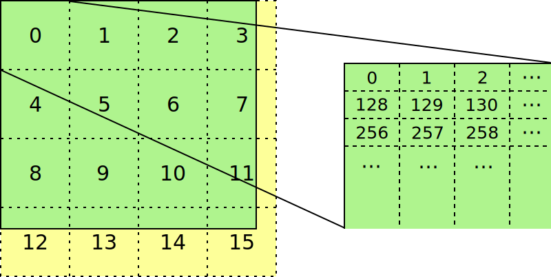

Tiling
======

The naive view of an image in memory is that the pixels are stored one after
another in memory usually in an X-major order.  An image that is arranged in
this way is called "linear".  Linear images, while easy to reason about, can
have very bad cache locality.  Graphics operations tend to act on pixels that
are close together in 2-D euclidean space.  If you move one pixel to the right
or left in a linear image, you only move a few bytes to one side or the other
in memory.  However, if you move one pixel up or down you can end up kilobytes
or even megabytes away.

Tiling (sometimes referred to as swizzling) is a method of re-arranging the
pixels of a surface so that pixels which are close in 2-D euclidean space are
likely to be close in memory.

Basics
------

The basic idea of a tiled image is that the image is first divided into
two-dimensional blocks or tiles.  Each tile takes up a chunk of contiguous
memory and the tiles are arranged like pixels in linear surface.  This is best
demonstrated with a specific example. Suppose we have a RGBA8888 X-tiled
surface on Intel graphics.  Then the surface is divided into 128x8 pixel tiles
each of which is 4KB of memory.  Within each tile, the pixels are laid out like
a 128x8 linear image.  The tiles themselves are laid out row-major in memory
like giant pixels.  This means that, as long as you don't leave your 128x8
tile, you can move in both dimensions without leaving the same 4K page in
memory.

You can, however do even better than this.  Suppose that same image is,
instead, Y-tiled.  Then the surface is divided into 32x32 pixel tiles each of
which is 4KB of memory.  Within a tile, each 64B cache line corresponds to 4x4
pixel region of the image (you can think of it as a tile within a tile).  This
means that very small deviations don't even leave the cache line.  This added
bit of pixel shuffling is known to have a substantial performance impact in
most real-world applications.

Intel graphics has several different tiling formats that we'll discuss in
detail in later sections.  The most commonly used as of the writing of this
chapter is Y-tiling.  In all tiling formats the basic principal is the same:
The image is divided into tiles of a particular size and, within those tiles,
the data is re-arranged (or swizzled) based on a particular pattern.  A tile
size will always be specified in bytes by rows and the actual X-dimension of
the tile in elements depends on the size of the element in bytes.

Bit-6 Swizzling
^^^^^^^^^^^^^^^

On some older hardware, there is an additional address swizzle that is applied
on top of the tiling format.  This has been removed starting with Broadwell
because, as it says in the Broadwell PRM Vol 5 "Tiling Algorithm" (p. 17):

   Address Swizzling for Tiled-Surfaces is no longer used because the main
   memory controller has a more effective address swizzling algorithm.

Whether or not swizzling is enabled depends on the memory configuration of the
system.  Generally, systems with dual-channel RAM have swizzling enabled and
single-channel do not.  Supposedly, this swizzling allows for better balancing
between the two memory channels and increases performance. Because it depends
on the memory configuration which may change from one boot to the next, it
requires a run-time check.

The best documentation for bit-6 swizzling can be found in the Haswell PRM Vol.
5 "Memory Views" in the section entitled "Address Swizzling for Tiled-Y
Surfaces".  It exists on older platforms but the docs get progressively worse
the further you go back.

ISL Representation
------------------

The structure of any given tiling format is represented by ISL using the
:c:enum:`isl_tiling` enum and the :c:struct:`isl_tile_info` structure:

.. c:autoenum:: isl_tiling
   :file: src/intel/isl/isl.h
   :members:

.. c:autofunction:: isl_tiling_get_info
   :file: src/intel/isl/isl.c

.. c:autostruct:: isl_tile_info
   :members:

The ``isl_tile_info`` structure has two different sizes for a tile: a logical
size in surface elements and a physical size in bytes.  In order to determine
the proper logical size, the bits-per-block of the underlying format has to be
passed into ``isl_tiling_get_info``. The proper way to compute the size of an
image in bytes given a width and height in elements is as follows:

.. code-block:: c

   uint32_t width_tl = DIV_ROUND_UP(width_el * (format_bpb / tile_info.format_bpb),
                                    tile_info.logical_extent_el.w);
   uint32_t height_tl = DIV_ROUND_UP(height_el, tile_info.logical_extent_el.h);
   uint32_t row_pitch = width_tl * tile_info.phys_extent_el.w;
   uint32_t size = height_tl * tile_info.phys_extent_el.h * row_pitch;

It is very important to note that there is no direct conversion between
:c:member:`isl_tile_info.logical_extent_el` and
:c:member:`isl_tile_info.phys_extent_B`.  It is tempting to assume that the
logical and physical heights are the same and simply divide the width of
:c:member:`isl_tile_info.phys_extent_B` by the size of the format (which is
what the PRM does) to get :c:member:`isl_tile_info.logical_extent_el` but
this is not at all correct. Some tiling formats have logical and physical
heights that differ and so no such calculation will work in general.  The
easiest case study for this is W-tiling. From the Sky Lake PRM Vol. 2d,
"RENDER_SURFACE_STATE" (p. 427):

   If the surface is a stencil buffer (and thus has Tile Mode set to
   TILEMODE_WMAJOR), the pitch must be set to 2x the value computed based on
   width, as the stencil buffer is stored with two rows interleaved.

What does this mean?  Why are we multiplying the pitch by two?  What does it
mean that "the stencil buffer is stored with two rows interleaved"?  The
explanation for all these questions is that a W-tile (which is only used for
stencil) has a logical size of 64el x 64el but a physical size of 128B
x 32rows.  In memory, a W-tile has the same footprint as a Y-tile (128B
x 32rows) but every pair of rows in the stencil buffer is interleaved into
a single row of bytes yielding a two-dimensional area of 64el x 64el.  You can
consider this as its own tiling format or as a modification of Y-tiling.  The
interpretation in the PRMs vary by hardware generation; on Sandy Bridge they
simply said it was Y-tiled but by Sky Lake there is almost no mention of
Y-tiling in connection with stencil buffers and they are always W-tiled. This
mismatch between logical and physical tile sizes are also relevant for
hierarchical depth buffers as well as single-channel MCS and CCS buffers.

X-tiling
--------

The simplest tiling format available on Intel graphics (which has been
available since gen4) is X-tiling.  An X-tile is 512B x 8rows and, within the
tile, the data is arranged in an X-major linear fashion.  You can also look at
X-tiling as being an 8x8 cache line grid where the cache lines are arranged
X-major as follows:

======= ======= ======= ======= ======= ======= ======= =======
`0x000` `0x040` `0x080` `0x0c0` `0x100` `0x140` `0x180` `0x1c0`
`0x200` `0x240` `0x280` `0x2c0` `0x300` `0x340` `0x380` `0x3c0`
`0x400` `0x440` `0x480` `0x4c0` `0x500` `0x540` `0x580` `0x5c0`
`0x600` `0x640` `0x680` `0x6c0` `0x700` `0x740` `0x780` `0x7c0`
`0x800` `0x840` `0x880` `0x8c0` `0x900` `0x940` `0x980` `0x9c0`
`0xa00` `0xa40` `0xa80` `0xac0` `0xb00` `0xb40` `0xb80` `0xbc0`
`0xc00` `0xc40` `0xc80` `0xcc0` `0xd00` `0xd40` `0xd80` `0xdc0`
`0xe00` `0xe40` `0xe80` `0xec0` `0xf00` `0xf40` `0xf80` `0xfc0`
======= ======= ======= ======= ======= ======= ======= =======

Each cache line represents a piece of a single row of pixels within the image.
The memory locations of two vertically adjacent pixels within the same X-tile
always differs by 512B or 8 cache lines.

As mentioned above, X-tiling is slower than Y-tiling (though still faster than
linear).  However, until Sky Lake, the display scan-out hardware could only do
X-tiling so we have historically used X-tiling for all window-system buffers
(because X or a Wayland compositor may want to put it in a plane).

Bit-6 Swizzling
^^^^^^^^^^^^^^^

When bit-6 swizzling is enabled, bits 9 and 10 are XORed in with bit 6 of the
tiled address:

.. code-block:: c

   addr[6] ^= addr[9] ^ addr[10];

Y-tiling
--------

The Y-tiling format, also available since gen4, is substantially different from
X-tiling and performs much better in practice.  Each Y-tile is an 8x8 grid of cache lines arranged Y-major as follows:

======= ======= ======= ======= ======= ======= ======= =======
`0x000` `0x200` `0x400` `0x600` `0x800` `0xa00` `0xc00` `0xe00`
`0x040` `0x240` `0x440` `0x640` `0x840` `0xa40` `0xc40` `0xe40`
`0x080` `0x280` `0x480` `0x680` `0x880` `0xa80` `0xc80` `0xe80`
`0x0c0` `0x2c0` `0x4c0` `0x6c0` `0x8c0` `0xac0` `0xcc0` `0xec0`
`0x100` `0x300` `0x500` `0x700` `0x900` `0xb00` `0xd00` `0xf00`
`0x140` `0x340` `0x540` `0x740` `0x940` `0xb40` `0xd40` `0xf40`
`0x180` `0x380` `0x580` `0x780` `0x980` `0xb80` `0xd80` `0xf80`
`0x1c0` `0x3c0` `0x5c0` `0x7c0` `0x9c0` `0xbc0` `0xdc0` `0xfc0`
======= ======= ======= ======= ======= ======= ======= =======

Each 64B cache line within the tile is laid out as 4 rows of 16B each:

====== ====== ====== ====== ====== ====== ====== ====== ====== ====== ====== ====== ====== ====== ====== ======
`0x00` `0x01` `0x02` `0x03` `0x04` `0x05` `0x06` `0x07` `0x08` `0x09` `0x0a` `0x0b` `0x0c` `0x0d` `0x0e` `0x0f`
`0x10` `0x11` `0x12` `0x13` `0x14` `0x15` `0x16` `0x17` `0x18` `0x19` `0x1a` `0x1b` `0x1c` `0x1d` `0x1e` `0x1f`
`0x20` `0x21` `0x22` `0x23` `0x24` `0x25` `0x26` `0x27` `0x28` `0x29` `0x2a` `0x2b` `0x2c` `0x2d` `0x2e` `0x2f`
`0x30` `0x31` `0x32` `0x33` `0x34` `0x35` `0x36` `0x37` `0x38` `0x39` `0x3a` `0x3b` `0x3c` `0x3d` `0x3e` `0x3f`
====== ====== ====== ====== ====== ====== ====== ====== ====== ====== ====== ====== ====== ====== ====== ======

Y-tiling is widely regarded as being substantially faster than X-tiling so it
is generally preferred.  However, prior to Sky Lake, Y-tiling was not available
for scanout so X tiling was used for any sort of window-system buffers.
Starting with Sky Lake, we can scan out from Y-tiled buffers.

Bit-6 Swizzling
^^^^^^^^^^^^^^^

When bit-6 swizzling is enabled, bit 9 is XORed in with bit 6 of the tiled
address:

.. code-block:: c

   addr[6] ^= addr[9];

W-tiling
--------

W-tiling is a new tiling format added on Sandy Bridge for use in stencil
buffers.  W-tiling is similar to Y-tiling in that it's arranged as an 8x8
Y-major grid of cache lines.  The bytes within each cache line are arranged as
follows:

====== ====== ====== ====== ====== ====== ====== ======
`0x00` `0x01` `0x04` `0x05` `0x10` `0x11` `0x14` `0x15`
`0x02` `0x03` `0x06` `0x07` `0x12` `0x13` `0x16` `0x17`
`0x08` `0x09` `0x0c` `0x0d` `0x18` `0x19` `0x1c` `0x1d`
`0x0a` `0x0b` `0x0e` `0x0f` `0x1a` `0x1b` `0x1e` `0x1f`
`0x20` `0x21` `0x24` `0x25` `0x30` `0x31` `0x34` `0x35`
`0x22` `0x23` `0x26` `0x27` `0x32` `0x33` `0x36` `0x37`
`0x28` `0x29` `0x2c` `0x2d` `0x38` `0x39` `0x3c` `0x3d`
`0x2a` `0x2b` `0x2e` `0x2f` `0x3a` `0x3b` `0x3e` `0x3f`
====== ====== ====== ====== ====== ====== ====== ======

While W-tiling has been required for stencil all the way back to Sandy Bridge,
the docs are somewhat confused as to whether stencil buffers are W or Y-tiled.
This seems to stem from the fact that the hardware seems to implement W-tiling
as a sort of modified Y-tiling.  One example of this is the somewhat odd
requirement that W-tiled buffers have their pitch multiplied by 2.  From the
Sky Lake PRM Vol. 2d, "RENDER_SURFACE_STATE" (p. 427):

   If the surface is a stencil buffer (and thus has Tile Mode set to
   TILEMODE_WMAJOR), the pitch must be set to 2x the value computed based on
   width, as the stencil buffer is stored with two rows interleaved.

The last phrase holds the key here: "the stencil buffer is stored with two rows
interleaved".  More accurately, a W-tiled buffer can be viewed as a Y-tiled
buffer with each set of 4 W-tiled lines interleaved to form 2 Y-tiled lines. In
ISL, we represent a W-tile as a tiling with a logical dimension of 64el x 64el
but a physical size of 128B x 32rows.  This cleanly takes care of the pitch
issue above and seems to nicely model the hardware.

Tile4
-----

The tile4 format, introduced on Xe-HP, is somewhat similar to Y but with more
internal shuffling.  Each tile4 tile is an 8x8 grid of cache lines arranged
as follows:

======= ======= ======= ======= ======= ======= ======= =======
`0x000` `0x040` `0x080` `0x0a0` `0x200` `0x240` `0x280` `0x2a0`
`0x100` `0x140` `0x180` `0x1a0` `0x300` `0x340` `0x380` `0x3a0`
`0x400` `0x440` `0x480` `0x4a0` `0x600` `0x640` `0x680` `0x6a0`
`0x500` `0x540` `0x580` `0x5a0` `0x700` `0x740` `0x780` `0x7a0`
`0x800` `0x840` `0x880` `0x8a0` `0xa00` `0xa40` `0xa80` `0xaa0`
`0x900` `0x940` `0x980` `0x9a0` `0xb00` `0xb40` `0xb80` `0xba0`
`0xc00` `0xc40` `0xc80` `0xca0` `0xe00` `0xe40` `0xe80` `0xea0`
`0xd00` `0xd40` `0xd80` `0xda0` `0xf00` `0xf40` `0xf80` `0xfa0`
======= ======= ======= ======= ======= ======= ======= =======

Each 64B cache line within the tile is laid out the same way as for a Y-tile,
as 4 rows of 16B each:

====== ====== ====== ====== ====== ====== ====== ====== ====== ====== ====== ====== ====== ====== ====== ======
`0x00` `0x01` `0x02` `0x03` `0x04` `0x05` `0x06` `0x07` `0x08` `0x09` `0x0a` `0x0b` `0x0c` `0x0d` `0x0e` `0x0f`
`0x10` `0x11` `0x12` `0x13` `0x14` `0x15` `0x16` `0x17` `0x18` `0x19` `0x1a` `0x1b` `0x1c` `0x1d` `0x1e` `0x1f`
`0x20` `0x21` `0x22` `0x23` `0x24` `0x25` `0x26` `0x27` `0x28` `0x29` `0x2a` `0x2b` `0x2c` `0x2d` `0x2e` `0x2f`
`0x30` `0x31` `0x32` `0x33` `0x34` `0x35` `0x36` `0x37` `0x38` `0x39` `0x3a` `0x3b` `0x3c` `0x3d` `0x3e` `0x3f`
====== ====== ====== ====== ====== ====== ====== ====== ====== ====== ====== ====== ====== ====== ====== ======

Tiling as a bit pattern
-----------------------

There is one more important angle on tiling that should be discussed before we
finish.  Every tiling can be described by three things:

 1. A logical width and height in elements
 2. A physical width in bytes and height in rows
 3. A mapping from logical elements to physical bytes within the tile

We have spent a good deal of time on the first two because this is what you
really need for doing surface layout calculations.  However, there are cases in
which the map from logical to physical elements is critical.  One example is
W-tiling where we have code to do W-tiled encoding and decoding in the shader
for doing stencil blits because the hardware does not allow us to render to
W-tiled surfaces.

There are many ways to mathematically describe the mapping from logical
elements to physical bytes.  In the PRMs they give a very complicated set of
formulas involving lots of multiplication, modulus, and sums that show you how
to compute the mapping.  With a little creativity, you can easily reduce those
to a set of bit shifts and ORs.  By far the simplest formulation, however, is
as a mapping from the bits of the texture coordinates to bits in the address.
Suppose that :math:`(u, v)` is location of a 1-byte element within a tile.  If
you represent :math:`u` as :math:`u_n u_{n-1} \cdots u_2 u_1 u_0` where
:math:`u_0` is the LSB and :math:`u_n` is the MSB of :math:`u` and similarly
:math:`v = v_m v_{m-1} \cdots v_2 v_1 v_0`, then the bits of the address within
the tile are given by the table below:

=========================================== =========== =========== =========== =========== =========== =========== =========== =========== =========== =========== =========== ===========
 Tiling                                          11          10          9           8           7           6           5           4           3           2           1           0
=========================================== =========== =========== =========== =========== =========== =========== =========== =========== =========== =========== =========== ===========
:c:enumerator:`isl_tiling.ISL_TILING_X`     :math:`v_2` :math:`v_1` :math:`v_0` :math:`u_8` :math:`u_7` :math:`u_6` :math:`u_5` :math:`u_4` :math:`u_3` :math:`u_2` :math:`u_1` :math:`u_0`
:c:enumerator:`isl_tiling.ISL_TILING_Y0`    :math:`u_6` :math:`u_5` :math:`u_4` :math:`v_4` :math:`v_3` :math:`v_2` :math:`v_1` :math:`v_0` :math:`u_3` :math:`u_2` :math:`u_1` :math:`u_0`
:c:enumerator:`isl_tiling.ISL_TILING_W`     :math:`u_5` :math:`u_4` :math:`u_3` :math:`v_5` :math:`v_4` :math:`v_3` :math:`v_2` :math:`u_2` :math:`v_1` :math:`u_1` :math:`v_0` :math:`u_0`
:c:enumerator:`isl_tiling.ISL_TILING_4`     :math:`v_4` :math:`v_3` :math:`u_6` :math:`v_2` :math:`u_5` :math:`u_4` :math:`v_1` :math:`v_0` :math:`u_3` :math:`u_2` :math:`u_1` :math:`u_0`
=========================================== =========== =========== =========== =========== =========== =========== =========== =========== =========== =========== =========== ===========

Constructing the mapping this way makes a lot of sense when you think about
hardware.  It may seem complex on paper but "simple" things such as addition
are relatively expensive in hardware while interleaving bits in a well-defined
pattern is practically free. For a format that has more than one byte per
element, you simply chop bits off the bottom of the pattern, hard-code them to
0, and adjust bit indices as needed.  For a 128-bit format, for instance, the
Y-tiled pattern becomes :math:`u_2 u_1 u_0 v_4 v_3 v_2 v_1 v_0`.  The Sky Lake
PRM Vol. 5 in the section "2D Surfaces" contains an expanded version of the
above table (which we will not repeat here) that also includes the bit patterns
for the Ys and Yf tiling formats.
